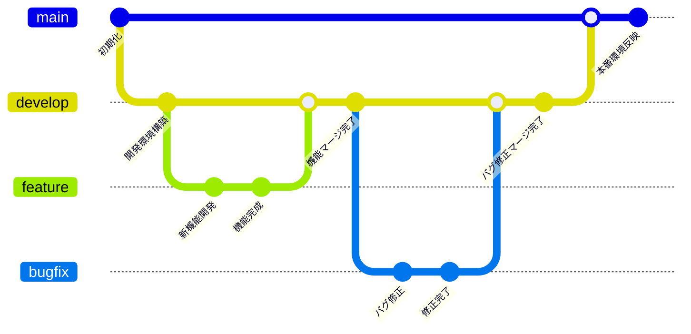

# 概要

- Retrieval-Augmented Generation (RAG) 技術を活用したチャットアプリケーションのバックエンド API

# 使用技術

- 言語：Python
- Web フレームワーク：FastAPI
- パッケージ管理：Poetry
- DB：MySQL
- ORM：SQLAlchemy
- AI サービス：Azure OpenAI（GPT-4o, Embedding API）
- RAG ライブラリ：LlamaIndex

# 開発について

## ポート設定について

- 開発環境のポート

  - アプリケーション: 8000 (標準)
  - MySQL: 3306 (標準)

- テスト環境のポート

  - アプリケーション: 8001 (開発環境との競合を回避)
  - MySQL: 3307 (開発環境との競合を回避)

- 設定ファイル
  - 開発環境: docker-compose.yml
  - テスト環境: docker-compose-test.yml

## 環境構築について

- リポジトリをクローン

  ```
  git clone {HTTPS or SSH URL}
  ```

- 初回起動時・設定変更時（イメージビルド）
  ※事前準備：.env.example をコピーして.env ファイルを作成し、プロジェクト直下に配置

  ```
  docker compose build
  ```

- コンテナ起動

  ```
  docker compose up -d
  ```

## Swagger

- http://localhost:8000/docs にアクセスし、SwaggerUI を開く

### API 実行方法

1.  API のエンドポイント一覧が表示されるので、実行したいエンドポイント展開させる
2.  「Try it out」ボタンを押下し、必要に応じてパラメータとリクエストボディを入力する
3.  「Execute」ボタンを押下し、API 実行

## src/rag_chat_backend ディレクトリについて

- api：エンドポイント定義、リクエスト/レスポンスの処理
- core：アプリケーション全体の設定
- exceptions：カスタム例外クラスの定義
- handlers：エラー発生時の処理・例外ハンドリング
- loggers：ログ出力の設定・管理
- logic：ビジネスロジック（DB 操作は含まない）
- models：
  - db：テーブル定義
  - response：API レスポンス用のモデル定義
  - request：API リクエスト用のモデル定義
- repositories：DB への CRUD 操作、クエリ実行
- services：外部サービスとの通信
- store：ナレッジの管理

## 開発用依存関係について

以下のツールは `[tool.poetry.group.dev.dependencies] `に含まれているため、仮想環境内でのみ使用可能：

- ruff: コード品質管理ツール
- pytest: テストフレームワーク

※ これらを使用する際は、本番環境（Docker コンテナ）には含まれていないため、仮想環境に入ってから実行

#### プロジェクトのセットアップ

```
# プロジェクトディレクトリに移動
cd rag-chat-backend

# Python バージョンを設定
# 本プロジェクトは Python 3.13 を使用しているため、開発環境でもDockerコンテナと同じバージョンに揃える
pyenv local 3.13.0

# 依存関係をインストール（.venv が自動作成される）
poetry install
```

#### 他の開発者が追加したパッケージの同期

```
# Git で最新のコードを取得後
git pull

# 依存関係を同期
poetry install
```

#### 仮想環境に入る

```
source .venv/bin/activate
```

#### 仮想環境から抜ける

```
deactivate
```

## コード品質管理について

- Python のコード整形および静的解析ツールとして Ruff を導入

### Ruff

#### 役割

- 未定義変数、到達不能コード、型の不整合を検出
- バグにつながるコードパターンを警告
- PEP8 準拠、インポート順序、命名規則の統一
- パスパラメータの未使用検出

#### 実行方法

1. 仮想環境に入る
2. 以下のコマンドを実行

   ```
   # コードの問題をチェック
   make lint

   # 自動修正可能な問題を修正
   make format
   ```

# テストについて

## 基本方針

- tests ディレクトリ配下にテストファイルを作成
- アプリケーション構造と同じ階層構造で管理
- テストフレームワークとして pytest を使用（unittest モジュールは使用しない）
- 命名規則
  - テストファイル: test\_\*.py
  - テスト関数: test\_\* で始める
  - テストクラス: Test\* で始める（関連するテストをグループ化する場合のみ使用）

### テスト実行について

1. 仮想環境に入る
2. テスト実行
   ```
   pytest
   ```

### FE での Playwright テスト

- FE での Playwright テスト実行時は、開発環境で使用している Docker コンテナとは別のコンテナを起動して実行
- コンテナ起動
  ※ テスト環境では .env.test の値を使用するため、.env に更新があった場合は、.env.test も合わせて更新
  ```
  docker compose -f docker-compose-test.yml --env-file .env.test -p rag-chat-backend-test up -d
  ```

# ブランチ運用について

## 概要

- 本プロジェクトでは、効率的な開発とコード品質の維持を目的とした Git ブランチ運用ルールを定めている。社内学習用プロジェクトのため、通常の release ブランチを経由したリリースフローは省略し、シンプルな運用を採用

## ブランチ構成

### main

- 目的: 本番環境の状態を管理
- 特徴: 常に安定した状態を保つ
- マージ元: develop ブランチ

### develop

- 目的: 開発版の統合ブランチ
- 特徴: 各機能開発の統合地点
- マージ元: feature/, bugfix/
- マージ先: main ブランチ

### feature

- 目的: 新機能開発用ブランチ
- 作成元・マージ先: develop ブランチ

### bugfix

- 目的: develop にマージ済み機能のバグ修正用
- 作成元・マージ先: develop ブランチ

### 運用フロー図



## 使用時のルール

### 開発フロー（マージ・被マージ）

1. develop ブランチから feature/bugfix ブランチ作成

   - 各担当者が開発・修正作業
   - タスク毎にブランチを作成

2. Pull Request 作成

   - develop ブランチへの Pull Request を作成
   - タイトルに MYIS-{チケット番号} を先頭に記載
     - ex）`MYIS-1234:ログイン機能追加`
   - Pull Request のテンプレート通りに記載すること
   - CI による単体テストクリアが必須

3. コードレビュー

   - 管理者がソースレビューを実施
   - 承認後にマージ

4. main ブランチへの反映
   - SP 完了後に実施：develop にマージ済みのブランチ（完了済みタスク）のみが対象となる
   - develop ブランチから main ブランチにマージ（例外: 本プロジェクトはリリースがないため、release ブランチを省略して develop → main に直接マージする）

### タスク別使用方法

- 新機能開発タスク

  - 使用ブランチ: feature/
  - 命名規則: feature/MYIS-{チケット番号}
    - ex）`feature/MYIS-1234`

- 既存機能バグ修正タスク
  - 使用ブランチ: bugfix/
  - 命名規則: bugfix/MYIS-{チケット番号}
    - ex）`bugfix/MYIS-1234`
  - 例外: チケット番号が追えない場合など不明な場合は、機能名や修正内容を明記する
    - ex）`bugfix/login-error-handling`

### 禁止事項

- 直接 Push 禁止: main、develop ブランチへの直接 Push
- Pull Request 必須: すべてのマージは Pull Request を経由
- CI 未通過でのマージ禁止: 単体テストクリアが必須条件
